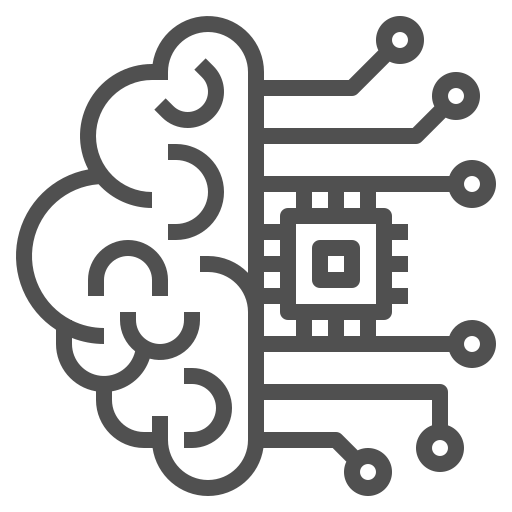

# NuroApp
<!-- PROJECT SHIELDS -->
[![Contributors][contributors-shield]][contributors-url]
[![Forks][forks-shield]][forks-url]
[![Stargazers][stars-shield]][stars-url]
[![Issues][issues-shield]][issues-url]
[![LinkedIn][linkedin-shield]][linkedin-url]
[![MIT License][license-shield]][license-url]

<!-- PROJECT LOGO -->
<br />
<p align="center">
  
  <h3 align="center">Nuro - Learning Machine Learning is Fun! </h3>

  <p align="center">
    <br />
    <a href="https://github.com/anisdismail/tree/main/NuroApp"><strong>Explore the docs »</strong></a>
    <br />
    <br />
    <a href="https://github.com/anisdismai/ltree/main/NuroApp">View Demo</a>
    ·
    <a href="https://github.com/anisdismail/NuroApp/issues">Report Bug</a>
    ·
    <a href="https://github.com/anisdismail/NuroApp/issues">Request Feature</a>
  </p>
</p>


<!-- TABLE OF CONTENTS -->
<details open="open">
  <summary><h2 style="display: inline-block">Table of Contents</h2></summary>
  <ol>
    <li>
      <a href="#about-the-project">About The Project</a>
      <ul>
        <li><a href="#built-with">Built With</a></li>
      </ul>
    </li>
    <li>
      <a href="#getting-started">Getting Started</a>
      <ul>
        <li><a href="#prerequisites">Prerequisites</a></li>
        <li><a href="#installation">Installation</a></li>
      </ul>
    </li>
    <li><a href="#usage">Usage</a></li>
    <li><a href="#roadmap">Roadmap</a></li>
    <li><a href="#contributing">Contributing</a></li>
   <!-- <li><a href="#license">License</a></li> -->
    <li><a href="#contact">Contact</a></li>
    <li><a href="#acknowledgements">Acknowledgements</a></li>
  </ol>
</details>


<!-- ABOUT THE PROJECT -->
## About The Project
In this project, we designed and implemented a not-for-profit Android application developed in Android Studio that teaches teens and high school students about Machine Learning in a fun and interactive way. The app is called “Nuro”, inspired by neural networks, an emerging technology in Artificial Intelligence.
### Built With

* [Android Studio]()
* [Java]()

<!-- GETTING STARTED -->
## Getting Started

To get a local copy up and running follow these simple steps.

### Prerequisites

* All required packages can be installed as follow:
  ```sh
  
  ```
* **Please note that this project requires a GPU for training**
### Installation

1. Clone the repo
   ```sh
   git clone https://github.com/anisdismail/NuroApp.git
   ```
2. Change to the project repositry:
   ```sh
   cd NuroApp

   ```

<!-- USAGE EXAMPLES -->
## Usage


<!-- ROADMAP -->
## Roadmap


See the [open issues](https://github.com/github_username/repo_name/issues) for a list of proposed features (and known issues).


<!-- CONTRIBUTING -->
## Contributing

Contributions are what make the open source community such an amazing place to be learn, inspire, and create. Any contributions you make are **greatly appreciated**.

1. Fork the Project
2. Create your Feature Branch (`git checkout -b feature/AmazingFeature`)
3. Commit your Changes (`git commit -m 'Add some AmazingFeature'`)
4. Push to the Branch (`git push origin feature/AmazingFeature`)
5. Open a Pull Request


<!-- LICENSE 
## License

Distributed under the MIT License. See `LICENSE` for more information.
-->


<!-- CONTACT -->
## Contact

Your Name - [Anis Ismail](https://linkedin.com/in/anisdimail) - anisismail09[at]gmail[dot]com

Project Link: [https://github.com/anisdismail/NuroApp](https://github.com/anisdismail/NuroApp)


<!-- ACKNOWLEDGEMENTS -->
## Acknowledgements

* [Anis Ismail](https://www.linkedin.com/in/anisdismail)
* [Karim Mrad]()
* [Khalil ElDaou]()
* [Joey ElGhreichi]()


<!-- MARKDOWN LINKS & IMAGES -->
<!-- https://www.markdownguide.org/basic-syntax/#reference-style-links -->
[contributors-shield]: https://img.shields.io/github/contributors/anisdismail/NuroApp.svg?style=for-the-badge
[contributors-url]: https://github.com/anisdismail/NuroApp/graphs/contributors
[forks-shield]: https://img.shields.io/github/forks/anisdismail/NuroApp.svg?style=for-the-badge
[forks-url]: https://github.com/anisdismail/NuroApp/network/members
[stars-shield]: https://img.shields.io/github/stars/anisdismail/NuroApp.svg?style=for-the-badge
[stars-url]: https://github.com/anisdismail/NuroApp/stargazers
[issues-shield]: https://img.shields.io/github/issues/anisdismail/NuroApp.svg?style=for-the-badge
[issues-url]: https://github.com/anisdismail/NuroApp/issues
[linkedin-shield]: https://img.shields.io/badge/-LinkedIn-black.svg?style=for-the-badge&logo=linkedin&colorB=555
[linkedin-url]: https://linkedin.com/in/anisdimail
[license-shield]: https://img.shields.io/github/license/anisdismail/NuroApp.svg?style=for-the-badge
[license-url]: https://github.com/anisdismail/NuroApp/blob/master/LICENSE
