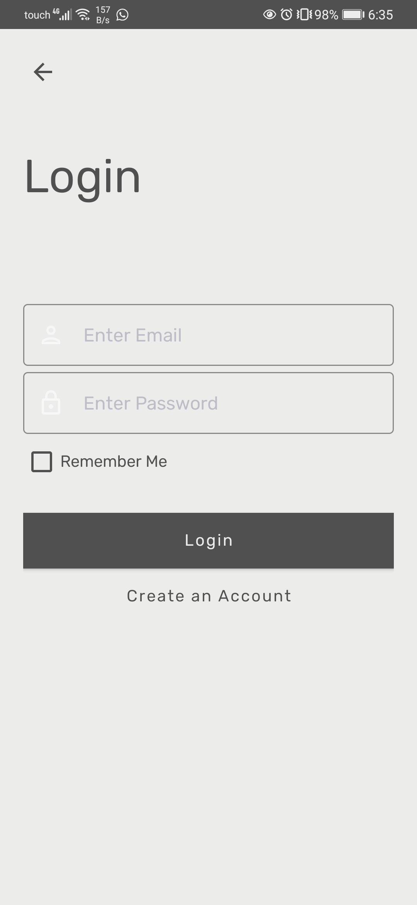
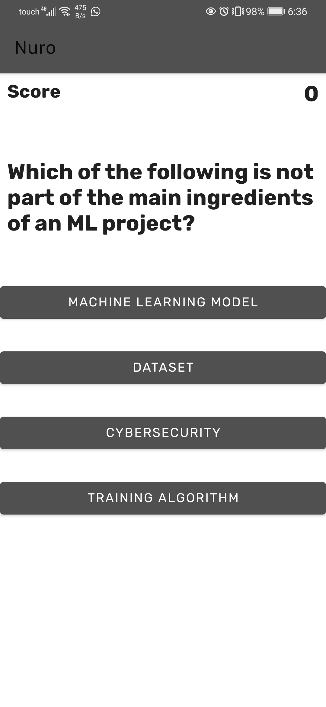

# NuroApp
<!-- PROJECT SHIELDS -->
[![Contributors][contributors-shield]][contributors-url]
[![Forks][forks-shield]][forks-url]
[![Stargazers][stars-shield]][stars-url]
[![Issues][issues-shield]][issues-url]
[![LinkedIn][linkedin-shield]][linkedin-url]
[![MIT License][license-shield]][license-url]

<!-- PROJECT LOGO -->
<br />
<p align="center">
  
  <h3 align="center">Nuro - Learning Machine Learning is Fun! </h3>

  <p align="center">
    <br />
    <a href="https://github.com/anisdismail/tree/main/NuroApp"><strong>Explore the docs »</strong></a>
    <br />
    <br />
    <a href="https://github.com/anisdismai/ltree/main/NuroApp">View Demo</a>
    ·
    <a href="https://github.com/anisdismail/NuroApp/issues">Report Bug</a>
    ·
    <a href="https://github.com/anisdismail/NuroApp/issues">Request Feature</a>
  </p>
</p>


<!-- TABLE OF CONTENTS -->
<details open="open">
  <summary><h2 style="display: inline-block">Table of Contents</h2></summary>
  <ol>
    <li>
      <a href="#about-the-project">About The Project</a>
      <ul>
        <li><a href="#built-with">Built With</a></li>
      </ul>
    </li>
    <li>
      <a href="#getting-started">Getting Started</a>
      <ul>
        <li><a href="#prerequisites">Prerequisites</a></li>
        <li><a href="#installation">Installation</a></li>
      </ul>
    </li>
    <li><a href="#usage">Usage</a></li>
    <li><a href="#roadmap">Roadmap</a></li>
    <li><a href="#contributing">Contributing</a></li>
   <!-- <li><a href="#license">License</a></li> -->
    <li><a href="#contact">Contact</a></li>
    <li><a href="#acknowledgements">Acknowledgements</a></li>
  </ol>
</details>


<!-- ABOUT THE PROJECT -->
## About The Project
In this project, we designed and implemented a not-for-profit Android application developed in Android Studio that teaches teens and high school students about Machine Learning in a fun and interactive way. The app is called “Nuro”, inspired by neural networks, an emerging technology in Artificial Intelligence.
### Built With

* [Android Studio]()
* [Java]()

<!-- GETTING STARTED -->
## Getting Started

To get a local copy up and running follow these simple steps.

### Prerequisites

*  All required dependencies can be installed with **Gradle**.

### Installation

1. Clone the repo
   ```sh
   git clone https://github.com/anisdismail/NuroApp.git
   ```
2. Change to the project repositry:
   ```sh
   cd NuroApp

   ```
3. Load and Run the Project in Android Studio
 
<!-- USAGE EXAMPLES -->
## About the Project

### 1. Log In Page: <br>
 <br>
The user is prompted to enter their email address and password. Both fields are required to be not empty, and the email text needs to conform to the general email text form. The user can enter their credentials, they will then either be prompted to activate their account from their email, or just log in (depending on whether they had activated it before or not). The authentication makes use of the firebase authentication module, we persist the sign in state so as to not require a login each time the app is opened. If the user does not have an account, he can create one by clicking on the “Create an Account” button.

### 2. Sign Up Page: <br>
 <br>
The user enters their first name, last name, username, email and password, all of which need to conform to their own specific standard (password length, email, text fields not empty). Should the user misconfigure one of them, a small note would be triggered from the edit text.

### 3. Tutorials: 
<div>


<p style="clear: both;">
</div>
<br>
Through the tutorials, the user can learn several ML concepts. In the first module, the user will learn their way through machine learning workflow. There are 7 steps in this tutorial, and every time the user presses next, they will move on to the next step. <br>

 

As the user progresses through learning about ML, the user is prompted to solve a quiz. We also keep track of the score to show how many questions were correct. Finally, in case the user selected the wrong answer, they will be prompted with an alert dialogue to show it was incorrect and try again. 

### 4. Project:
<div>


<p style="clear: both;">
 </div>
 
-	After successfully completing the quiz, the user will then move to the final part of the module. 
-	In this project, the user will be asked to use the knowledge acquired in this module to build a ML workflow from start to end. 
-	The user can drag any shape from the top layout to the drawing region and can connect it to any other shape. 
-	Once the user is satisfied with the design, the user can press on the validate button (back triangle) to validate if the design is correct or not.
-	The user can press the home button to return to the main activity.
-	The user can also press the trash button to eliminate a shape from the graph.
-	To delete all the shapes, the press should press the half cycle button to reset the design.


<!-- ROADMAP -->
## Roadmap


See the [open issues](https://github.com/github_username/repo_name/issues) for a list of proposed features (and known issues).


<!-- CONTRIBUTING -->
## Contributing

Contributions are what make the open source community such an amazing place to be learn, inspire, and create. Any contributions you make are **greatly appreciated**.

1. Fork the Project
2. Create your Feature Branch (`git checkout -b feature/AmazingFeature`)
3. Commit your Changes (`git commit -m 'Add some AmazingFeature'`)
4. Push to the Branch (`git push origin feature/AmazingFeature`)
5. Open a Pull Request


<!-- LICENSE 
## License

Distributed under the MIT License. See `LICENSE` for more information.
-->


<!-- CONTACT -->
## Contact

Your Name - [Anis Ismail](https://linkedin.com/in/anisdimail) - anisismail09[at]gmail[dot]com

Project Link: [https://github.com/anisdismail/NuroApp](https://github.com/anisdismail/NuroApp)


<!-- ACKNOWLEDGEMENTS -->
## Acknowledgements

* [Anis Ismail](https://www.linkedin.com/in/anisdismail)
* [Karim Mrad]()
* [Khalil ElDaou]()
* [Joey ElGhreichi]()


<!-- MARKDOWN LINKS & IMAGES -->
<!-- https://www.markdownguide.org/basic-syntax/#reference-style-links -->
[contributors-shield]: https://img.shields.io/github/contributors/anisdismail/NuroApp.svg?style=for-the-badge
[contributors-url]: https://github.com/anisdismail/NuroApp/graphs/contributors
[forks-shield]: https://img.shields.io/github/forks/anisdismail/NuroApp.svg?style=for-the-badge
[forks-url]: https://github.com/anisdismail/NuroApp/network/members
[stars-shield]: https://img.shields.io/github/stars/anisdismail/NuroApp.svg?style=for-the-badge
[stars-url]: https://github.com/anisdismail/NuroApp/stargazers
[issues-shield]: https://img.shields.io/github/issues/anisdismail/NuroApp.svg?style=for-the-badge
[issues-url]: https://github.com/anisdismail/NuroApp/issues
[linkedin-shield]: https://img.shields.io/badge/-LinkedIn-black.svg?style=for-the-badge&logo=linkedin&colorB=555
[linkedin-url]: https://linkedin.com/in/anisdimail
[license-shield]: https://img.shields.io/github/license/anisdismail/NuroApp.svg?style=for-the-badge
[license-url]: https://github.com/anisdismail/NuroApp/blob/master/LICENSE
